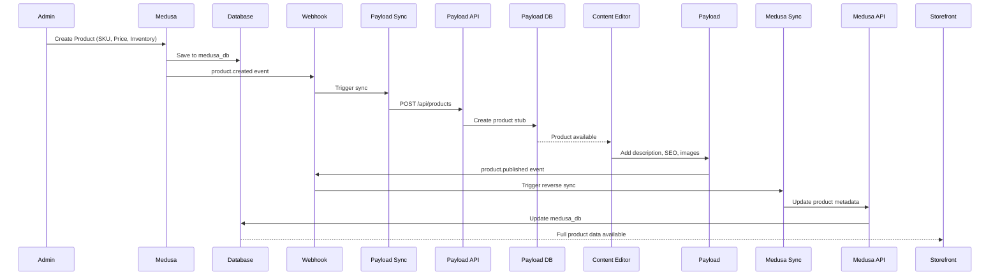
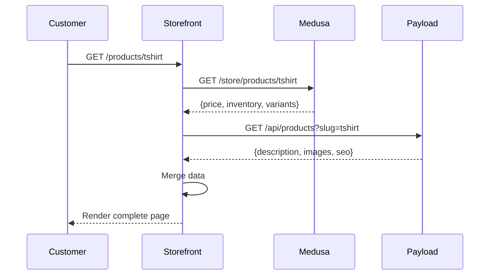
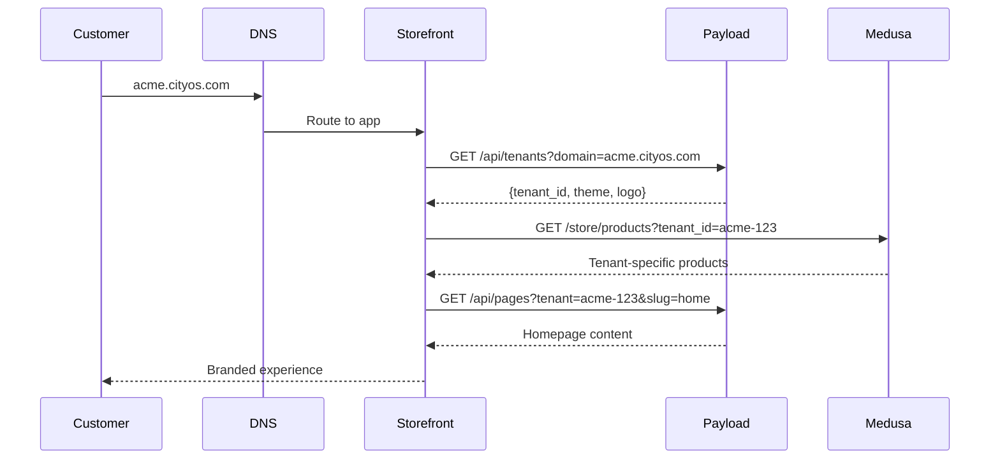

# Medusa + Payload CMS Integration Architecture

## Overview

This platform uses a **dual-system architecture** where Medusa 2.0 handles commerce operations and Payload CMS 3.0 manages content. They operate as separate applications with bi-directional synchronization.

```
┌─────────────────────────────────────────────────────────────────┐
│                         CLIENT LAYER                             │
│  ┌──────────────┐  ┌──────────────┐  ┌──────────────┐          │
│  │  Storefront  │  │ Admin Panel  │  │  Mobile App  │          │
│  │  (Port 9002) │  │ (Port 9001)  │  │    (Future)  │          │
│  └──────────────┘  └──────────────┘  └──────────────┘          │
└─────────────────────────────────────────────────────────────────┘
           │                  │                  │
           ▼                  ▼                  ▼
┌─────────────────────────────────────────────────────────────────┐
│                      AUTHENTICATION LAYER                        │
│                     Keycloak (Port 8080)                         │
│              Multi-tenant SSO, RBAC, OAuth 2.0                   │
└─────────────────────────────────────────────────────────────────┘
           │                                      │
           ▼                                      ▼
┌──────────────────────────┐    ┌──────────────────────────────┐
│    MEDUSA BACKEND        │◄──►│    PAYLOAD CMS               │
│    (Port 9001)           │    │    (Port 3001)               │
├──────────────────────────┤    ├──────────────────────────────┤
│ COMMERCE ENGINE          │    │ CONTENT MANAGEMENT           │
│ - Products               │    │ - Landing Pages              │
│ - Orders                 │    │ - Blog Posts                 │
│ - Customers              │    │ - Hero Sections              │
│ - Cart                   │    │ - Media Library              │
│ - Payments               │    │ - Tenant Config              │
│ - Shipping               │    │ - Store Settings             │
│ - Inventory              │    │ - CMS Collections            │
│ - Promotions             │    │ - Rich Content               │
│                          │    │                              │
│ CUSTOM MODULES           │    │ TENANT SYSTEM                │
│ - Tenants                │    │ - Multi-tenant Isolation     │
│ - Vendors                │    │ - Domain Routing             │
│ - Subscriptions          │    │ - Tenant-specific Content    │
│ - B2B Companies          │    │ - Store Branding             │
│ - Quotes/RFQ             │    │                              │
│ - Volume Pricing         │    │                              │
│ - Commissions            │    │                              │
│ - Payouts                │    │                              │
│                          │    │                              │
│ DATABASE: medusa_db      │    │ DATABASE: payload_db         │
│ (PostgreSQL)             │    │ (PostgreSQL)                 │
└──────────────────────────┘    └──────────────────────────────┘
           │                                      │
           └──────────────────┬──────────────────┘
                              ▼
                ┌──────────────────────────┐
                │  INTEGRATION LAYER       │
                │  - Bi-directional Sync   │
                │  - Webhooks              │
                │  - Scheduled Jobs        │
                │  - Event Bus             │
                └──────────────────────────┘
```

---

## Why Two Separate Systems?

### Separation of Concerns

| Aspect | Medusa | Payload |
|--------|--------|---------|
| **Purpose** | Commerce transactions | Content management |
| **Optimized For** | High-volume orders, real-time inventory | Content editing, media management |
| **Primary Users** | Developers, customers | Marketers, content creators |
| **Data Model** | Transactional (products, orders) | Hierarchical (pages, posts) |
| **Scaling Needs** | Horizontal (order processing) | Vertical (content delivery) |
| **Update Frequency** | High (every order) | Low (content updates) |

### Benefits

1. **Technology Flexibility** - Each system uses its ideal tech stack
2. **Independent Scaling** - Scale commerce and content separately
3. **Specialized Features** - Leverage best-in-class tools for each domain
4. **Development Speed** - Teams can work independently
5. **Risk Mitigation** - Failure in one doesn't crash the other
6. **Database Optimization** - Different indexing strategies per use case

---

## Integration Mechanisms

### 1. Bi-Directional Sync Service

**Location:** `/workspace/apps/backend/src/integrations/payload-sync/`

#### Medusa → Payload Sync
```typescript
// File: medusa-to-payload.ts

// What Gets Synced:
- Tenants (create, update)
- Stores (create, update, link to tenant)
- Products (enhanced with commerce data)
- Orders (for content personalization)

// When:
- On entity creation/update in Medusa
- Scheduled job (hourly)
- Manual trigger via API

// Example Flow:
1. New product created in Medusa
2. Webhook triggers sync service
3. Product data enriched with SEO fields
4. Pushed to Payload as "Product" collection
5. Available for content editors
```

#### Payload → Medusa Sync
```typescript
// File: payload-to-medusa.ts

// What Gets Synced:
- Product SEO metadata
- Product descriptions (rich text)
- Category descriptions
- Store branding/theme
- Media URLs

// When:
- Content published in Payload
- Scheduled job (hourly)
- Manual trigger via API

// Example Flow:
1. Editor updates product description in Payload
2. Webhook triggers sync service
3. Description converted to Medusa format
4. Updated in Medusa product metadata
5. Available on storefront
```

### 2. Webhook Integration

**Medusa Webhooks → Payload**
```bash
POST https://payload.example.com/api/webhooks/medusa

Events:
- product.created
- product.updated
- order.placed
- tenant.created
- store.created
```

**Payload Webhooks → Medusa**
```bash
POST https://medusa.example.com/api/admin/webhooks/payload

Events:
- product.published
- page.published
- media.uploaded
- tenant.updated
```

### 3. Direct API Calls

**Storefront Usage:**
```typescript
// Fetch from both systems simultaneously
const [products, heroContent] = await Promise.all([
  // Commerce data from Medusa
  sdk.store.product.list({ 
    tenant_id: "tenant-123",
    limit: 20 
  }),
  
  // Content data from Payload
  fetch('https://payload/api/hero-sections?tenant=tenant-123')
    .then(r => r.json())
])

// Render combined data
return (
  <Layout>
    <HeroSection content={heroContent} />
    <ProductGrid products={products} />
  </Layout>
)
```

### 4. Shared Authentication (Keycloak)

Both systems authenticate against the same Keycloak instance:

```typescript
// Medusa validates JWT
app.use(keycloakAuth({
  realm: 'cityos',
  clientId: 'medusa-backend'
}))

// Payload validates JWT
export default buildConfig({
  admin: {
    user: 'User',
    auth: {
      strategies: [keycloakStrategy]
    }
  }
})
```

---

## Data Flow Examples

### Example 1: Creating a New Product



### Example 2: Storefront Page Load



### Example 3: Multi-Tenant Content



---

## When to Use Which System?

### Use Medusa For:

✅ **Commerce Operations**
- Product catalog management (SKUs, variants, options)
- Inventory tracking
- Order processing
- Cart operations
- Payment processing
- Shipping calculations
- Customer accounts
- Promotions and discounts
- B2B quotes and pricing
- Subscription billing
- Vendor commissions

✅ **Transactional Data**
- Real-time inventory
- Order history
- Customer purchase data
- Payment records

✅ **Business Logic**
- Pricing rules
- Tax calculations
- Shipping logic
- Workflow orchestration

**API Endpoint:** `https://backend.example.com/store/*`

---

### Use Payload For:

✅ **Content Management**
- Landing pages
- Blog posts
- Marketing content
- Hero sections
- Announcements
- FAQs
- About pages
- Terms of service

✅ **Rich Media**
- Product photography
- Marketing images
- Videos
- PDFs and downloads

✅ **SEO & Marketing**
- Meta descriptions
- OpenGraph tags
- Product descriptions (rich text)
- Category descriptions

✅ **Tenant Configuration**
- Store branding (logos, colors)
- Domain settings
- Theme customization
- Store-specific content

✅ **User-Friendly Editing**
- WYSIWYG editor for non-technical users
- Media library management
- Content versioning
- Draft/publish workflows

**API Endpoint:** `https://cms.example.com/api/*`

---

## Database Schema Overlap

### Data Stored in BOTH Systems

| Entity | Medusa Storage | Payload Storage | Sync Direction |
|--------|---------------|-----------------|----------------|
| **Tenant** | `tenant` table (core data) | `tenants` collection (config) | Bi-directional |
| **Store** | `cityos_store` table (core) | `stores` collection (branding) | Bi-directional |
| **Product** | Full commerce data | SEO + content only | Bi-directional |
| **Category** | Taxonomy structure | Descriptions + SEO | Medusa → Payload |
| **Media** | References only | Full files + metadata | Payload → Medusa |

### Medusa-Only Data

- Orders
- Customers
- Cart
- Payments
- Shipping methods
- Inventory levels
- Promotions
- Subscriptions
- Commissions
- Payouts

### Payload-Only Data

- Pages
- Blog posts
- Hero sections
- Navigations
- Forms
- Announcements
- Site settings
- Media files (originals)

---

## Configuration Files

### Medusa Integration Config

**File:** `/workspace/apps/backend/src/integrations/payload-sync/index.ts`

```typescript
export const PAYLOAD_CONFIG = {
  baseUrl: process.env.PAYLOAD_API_URL || 'http://localhost:3001',
  apiKey: process.env.PAYLOAD_API_KEY,
  
  sync: {
    enabled: true,
    interval: '0 * * * *', // Hourly
    batchSize: 100,
    retryAttempts: 3
  },
  
  collections: {
    tenants: 'tenants',
    stores: 'stores',
    products: 'products',
    media: 'media'
  }
}
```

### Payload Integration Config

**File:** `/workspace/apps/orchestrator/src/config/medusa.ts`

```typescript
export const MEDUSA_CONFIG = {
  baseUrl: process.env.MEDUSA_API_URL || 'http://localhost:9001',
  publishableKey: process.env.MEDUSA_PUBLISHABLE_KEY,
  
  sync: {
    enabled: true,
    webhookSecret: process.env.MEDUSA_WEBHOOK_SECRET
  }
}
```

---

## API Endpoints

### Medusa APIs for Integration

```bash
# Admin APIs (requires authentication)
GET    /admin/tenants              # List tenants
POST   /admin/tenants              # Create tenant
GET    /admin/tenants/:id          # Get tenant
PATCH  /admin/tenants/:id          # Update tenant

GET    /admin/products             # List products with full data
POST   /admin/products             # Create product
PATCH  /admin/products/:id         # Update product

# Webhook receiver
POST   /admin/webhooks/payload     # Receive Payload webhooks

# Sync trigger (manual)
POST   /admin/sync/to-payload      # Trigger Medusa → Payload sync
POST   /admin/sync/from-payload    # Trigger Payload → Medusa sync

# Store APIs (public)
GET    /store/products             # Get products for storefront
GET    /store/products/:id         # Get single product
```

### Payload APIs for Integration

```bash
# Admin APIs (requires authentication)
GET    /api/tenants                # List tenants
POST   /api/tenants                # Create tenant
GET    /api/tenants/:id            # Get tenant
PATCH  /api/tenants/:id            # Update tenant

GET    /api/products               # List products (content)
POST   /api/products               # Create product content
PATCH  /api/products/:id           # Update product content

GET    /api/pages                  # List pages
GET    /api/media                  # List media files

# Webhook receiver
POST   /api/webhooks/medusa        # Receive Medusa webhooks

# Sync status
GET    /api/sync/status            # Get sync health
POST   /api/sync/trigger           # Manual sync trigger

# Public APIs
GET    /api/public/hero-sections   # Get hero content
GET    /api/public/pages/:slug     # Get page by slug
```

---

## Sync Job Schedule

### Automated Sync Jobs

| Job | Frequency | Direction | Purpose |
|-----|-----------|-----------|---------|
| **Product Sync** | Hourly | Medusa → Payload | Keep product catalog in sync |
| **Content Sync** | Hourly | Payload → Medusa | Update product descriptions |
| **Tenant Config** | On Change | Bi-directional | Sync tenant settings |
| **Media Sync** | On Upload | Payload → Medusa | Share media URLs |
| **Order Summary** | Daily | Medusa → Payload | Analytics/reporting |

### Manual Sync Triggers

```bash
# From Medusa Admin
POST /admin/sync/to-payload
Body: {
  "entity": "products",
  "ids": ["prod_123", "prod_456"]
}

# From Payload Admin
POST /api/sync/trigger
Body: {
  "collection": "products",
  "ids": ["payload-123"]
}
```

---

## Error Handling & Resilience

### Sync Failure Recovery

```typescript
// Automatic retry with exponential backoff
const syncWithRetry = async (data, maxRetries = 3) => {
  for (let attempt = 0; attempt < maxRetries; attempt++) {
    try {
      return await syncToPayload(data)
    } catch (error) {
      if (attempt === maxRetries - 1) throw error
      await sleep(Math.pow(2, attempt) * 1000)
    }
  }
}

// Dead letter queue for failed syncs
if (syncFailed) {
  await redis.lpush('sync:failed', JSON.stringify({
    entity,
    data,
    error,
    timestamp: Date.now()
  }))
}
```

### System Independence

- **Medusa can operate without Payload** - Commerce functions work independently
- **Payload can operate without Medusa** - Content management continues
- **Eventual consistency** - Systems sync when both available
- **Fallback data** - Storefront uses cached data if one system is down

---

## Development Workflow

### Starting Both Systems

```bash
# From workspace root
pnpm dev

# This starts:
# - Medusa backend (localhost:9001)
# - Payload CMS (localhost:3001)
# - Storefront (localhost:9002)
```

### Local Development URLs

```bash
Medusa Backend:   http://localhost:9001
Medusa Admin:     http://localhost:9001/app
Medusa API Docs:  http://localhost:9001/docs

Payload CMS:      http://localhost:3001
Payload Admin:    http://localhost:3001/admin
Payload API Docs: http://localhost:3001/api-docs

Storefront:       http://localhost:9002
```

### Making Changes

**Adding a field to Product in both systems:**

1. **In Medusa** - Add to product module:
```typescript
// apps/backend/src/modules/product/models/product.ts
export const Product = model.define("product", {
  // ... existing fields
  new_field: model.text()
})
```

2. **In Payload** - Add to product collection:
```typescript
// apps/orchestrator/src/collections/Products.ts
export const Products: CollectionConfig = {
  fields: [
    // ... existing fields
    {
      name: 'new_field',
      type: 'text'
    }
  ]
}
```

3. **Update Sync Service:**
```typescript
// apps/backend/src/integrations/payload-sync/medusa-to-payload.ts
const syncProduct = async (product) => {
  await payloadAPI.post('/api/products', {
    // ... existing mappings
    new_field: product.new_field
  })
}
```

---

## Monitoring & Debugging

### Sync Status Monitoring

```typescript
// Check sync health
GET /api/admin/sync/status

Response:
{
  "medusa_to_payload": {
    "last_sync": "2024-01-15T10:00:00Z",
    "status": "success",
    "synced_count": 1250,
    "failed_count": 0
  },
  "payload_to_medusa": {
    "last_sync": "2024-01-15T10:05:00Z",
    "status": "success",
    "synced_count": 87,
    "failed_count": 0
  }
}
```

### Debugging Sync Issues

```bash
# Check Medusa logs
docker logs medusa-backend | grep "payload-sync"

# Check Payload logs
docker logs payload-cms | grep "medusa-webhook"

# Check sync queue
redis-cli LRANGE sync:failed 0 -1

# Retry failed syncs
POST /api/admin/sync/retry-failed
```

### Common Issues & Solutions

| Issue | Symptom | Solution |
|-------|---------|----------|
| **Sync lag** | Content not appearing | Check network between services |
| **Auth failure** | 401 errors in logs | Verify API keys in .env |
| **Data mismatch** | Fields missing | Check field mappings in sync service |
| **Webhook timeout** | Events not processing | Increase webhook timeout |
| **Database lock** | Slow syncs | Add index on sync_timestamp fields |

---

## Security Considerations

### API Key Management

```bash
# Medusa .env
PAYLOAD_API_KEY=secure_key_here
PAYLOAD_API_URL=https://cms.internal.example.com

# Payload .env
MEDUSA_API_KEY=secure_key_here
MEDUSA_API_URL=https://backend.internal.example.com
MEDUSA_WEBHOOK_SECRET=webhook_secret_here
```

### Network Security

- **Internal Network** - Keep Medusa ↔ Payload communication on private network
- **API Gateway** - Expose only necessary endpoints publicly
- **Rate Limiting** - Prevent sync abuse
- **Webhook Signatures** - Verify webhook authenticity

```typescript
// Verify webhook signature
const verifyWebhook = (payload, signature, secret) => {
  const expectedSignature = crypto
    .createHmac('sha256', secret)
    .update(payload)
    .digest('hex')
  
  return signature === expectedSignature
}
```

---

## Performance Optimization

### Caching Strategy

```typescript
// Cache product data in Redis
const getProduct = async (id) => {
  // Check cache first
  const cached = await redis.get(`product:${id}`)
  if (cached) return JSON.parse(cached)
  
  // Fetch from Medusa
  const medusaData = await medusa.products.retrieve(id)
  
  // Fetch from Payload
  const payloadData = await fetch(`${PAYLOAD_URL}/api/products/${id}`)
    .then(r => r.json())
  
  // Merge and cache
  const merged = { ...medusaData, ...payloadData }
  await redis.setex(`product:${id}`, 3600, JSON.stringify(merged))
  
  return merged
}
```

### Batch Operations

```typescript
// Sync in batches instead of one-by-one
const batchSync = async (products, batchSize = 50) => {
  const batches = chunk(products, batchSize)
  
  for (const batch of batches) {
    await Promise.all(
      batch.map(product => syncToPayload(product))
    )
    await sleep(100) // Rate limiting
  }
}
```

---

## Migration Guide

### Initial Data Migration (Medusa → Payload)

```bash
# Run initial sync script
cd apps/backend
pnpm exec medusa exec ./scripts/initial-payload-sync.ts

# This will:
# 1. Export all tenants from Medusa
# 2. Create corresponding tenants in Payload
# 3. Export all products
# 4. Create product stubs in Payload
# 5. Link stores and domains
```

### Ongoing Maintenance

- **Weekly**: Review sync logs for failures
- **Monthly**: Audit data consistency between systems
- **Quarterly**: Performance optimization review

---

## Future Enhancements

### Planned Improvements

1. **Real-time Sync** - WebSocket-based instead of polling
2. **Conflict Resolution** - Automatic merge of simultaneous edits
3. **Sync Analytics** - Dashboard for monitoring sync health
4. **Field Mapping UI** - Admin interface for configuring sync mappings
5. **Selective Sync** - Choose which fields/collections to sync per tenant

---

## Quick Reference

### Key Files

```
Integration Files:
├── apps/backend/src/integrations/payload-sync/
│   ├── medusa-to-payload.ts       # M→P sync logic
│   ├── payload-to-medusa.ts       # P→M sync logic
│   └── index.ts                   # Config & utilities
│
├── apps/backend/src/api/admin/webhooks/payload/
│   └── route.ts                   # Payload webhook receiver
│
├── apps/orchestrator/src/webhooks/
│   └── medusa.ts                  # Medusa webhook receiver
│
└── apps/orchestrator/src/config/
    └── medusa.ts                  # Medusa integration config
```

### Environment Variables

```bash
# Medusa .env
PAYLOAD_API_URL=http://localhost:3001
PAYLOAD_API_KEY=your_api_key

# Payload .env
MEDUSA_API_URL=http://localhost:9001
MEDUSA_PUBLISHABLE_KEY=your_publishable_key
MEDUSA_WEBHOOK_SECRET=your_webhook_secret
```

---

## Support & Troubleshooting

For integration issues, check:
1. Network connectivity between services
2. API keys in environment variables
3. Webhook configurations
4. Database connection status
5. Sync job logs

---

**Last Updated:** January 2024  
**Version:** 1.0.0
