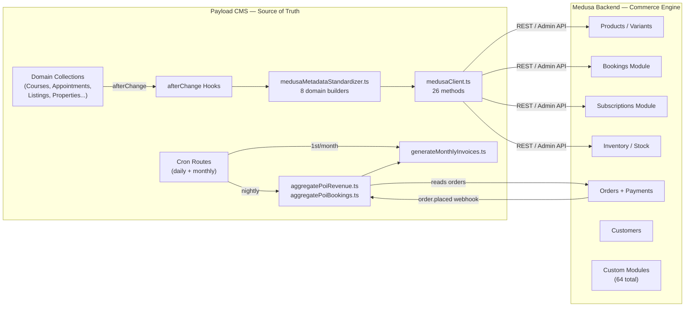

# Payload CMS ↔ Medusa — Integration Design Pattern

**Dakkah CityOS** | **Updated: 2026-02-20** | **Phase 30G Complete**

---

## 1. The Canonical Contract

> **Payload CMS** is the **system of record** for all domain content, entities, and business rules.
> **Medusa** is the **commerce engine** — payments, fulfillment, subscriptions, inventory, and order lifecycle.
> **Neither system talks to the other's internal database directly.** All integration is through APIs.



---

## 2. The Four Integration Patterns

Every Medusa module falls into exactly one of these four patterns:

### Pattern A — CMS Push (CMS → Medusa)

CMS is the trigger. When a CMS document is created/updated, an `afterChange` hook calls `medusaClient.ts` to upsert the corresponding Medusa entity. Canonical metadata is injected so orders can be traced back to CMS POIs.

**Used by:** education, healthcare, real-estate, agriculture, transportation, commerce, events-culture, citizen-services

### Pattern B — Webhook Pull (Medusa → CMS)

Medusa fires a webhook on order events. CMS catches it, looks up the `cms_poi_id` metadata, and refreshes its revenue aggregation.

**Used by:** The billing engine (POICommerceSummary, Invoices)

### Pattern C — CMS Query-Only (CMS reads Medusa)

CMS queries Medusa for data to display or aggregate. No push in either direction — pure read.

**Used by:** analytics dashboard, revenue reporting, customer data display

### Pattern D — Medusa-Autonomous (no CMS involvement)

Medusa module operates fully independently. CMS has no responsibility here — these are pure commerce/operations concerns.

**Used by:** payout, inventory-extension, loyalty (points calc), wallet, subscription billing, commission, trade-in, etc.

---

## 3. Canonical Metadata Schema

Every CMS→Medusa push injects this standard metadata object, enabling cross-system revenue attribution:

```typescript
{
  cms_poi_id:     string | null,  // POI or facility ID from CMS
  cms_domain:     string,         // "healthcare" | "education" | "real-estate" | ...
  cms_tenant_id:  string,         // CMS tenant document ID
  cms_collection: string,         // "healthcare-appointments" | "course-enrollments" | ...
  cms_id:         string,         // CMS document ID
  cms_title:      string,         // doc.title || doc.name
  cms_synced_at:  string,         // ISO timestamp
}
```

**How it's used:**

- Medusa stores it in `product.metadata` / `booking.metadata` / `order.metadata`
- CMS queries `GET /admin/orders?metadata[cms_poi_id]=X` to aggregate revenue per POI
- `generateMonthlyInvoices.ts` groups by `cms_tenant_id` to bill per tenant

---

## 4. Module Responsibility Map

### Legend

| Symbol    | Meaning                                                        |
| --------- | -------------------------------------------------------------- |
| 🟢 CMS    | CMS owns this — data originates in CMS, Medusa is the executor |
| 🔵 Medusa | Medusa owns this — operates independently, CMS has no role     |
| 🟡 Shared | Both systems have a role                                       |
| ⬜ None   | Module has no CMS integration (internal/infra)                 |

---

### Commerce Core

| Module                  | Pattern | CMS Responsibility                                                                                         | Medusa Responsibility                                            |
| ----------------------- | ------- | ---------------------------------------------------------------------------------------------------------- | ---------------------------------------------------------------- |
| **product** _(core)_    | A       | CMS creates/updates products via `createProduct()` / `updateProduct()` with canonical metadata             | Owns pricing, variants, inventory links, fulfillment routing     |
| **subscription**        | A       | CMS creates subscription products via `createSubscriptionProduct()` (e.g. TransitPasses, membership tiers) | Owns billing cycles, dunning, renewal workflows, payment capture |
| **inventory-extension** | D       | None — warehouse operations only                                                                           | Reservation holds, stock alerts, warehouse transfer tracking     |
| **invoice**             | 🟡      | CMS `generateMonthlyInvoices.ts` creates platform-commission invoices                                      | Stores invoice records; exposes via `/admin/invoices`            |
| **payout**              | D       | None                                                                                                       | Vendor payout calculation, Stripe disbursement, batch processing |
| **commission**          | D       | None                                                                                                       | Commission rate calculation, pending payout tracking per vendor  |
| **promotion-ext**       | D       | None                                                                                                       | Promotion stack resolution, bundle pricing, referral engine      |
| **volume-pricing**      | D       | None                                                                                                       | Tiered pricing rules applied at checkout                         |
| **wallet**              | D       | None                                                                                                       | Customer wallet balance, credits, payment at checkout            |

---

### Customer & Identity

| Module              | Pattern | CMS Responsibility                                                                                      | Medusa Responsibility                                                |
| ------------------- | ------- | ------------------------------------------------------------------------------------------------------- | -------------------------------------------------------------------- |
| **loyalty**         | 🟡      | CMS calls `addLoyaltyPoints()` / `redeemLoyaltyPoints()` for domain actions (enrollments, appointments) | Owns point balance, tier rules, transaction history, expiry          |
| **review**          | D       | None — reviews are Medusa-side user-generated content                                                   | Store, approve, flag, aggregate ratings; expose via `/store/reviews` |
| **wishlist**        | D       | None                                                                                                    | Wishlist CRUD, share tokens, move-between-lists                      |
| **persona**         | D       | None                                                                                                    | Segment evaluation, persona classification from order/behavior data  |
| **affiliate**       | D       | None                                                                                                    | Referral tracking, commission attribution, affiliate link management |
| **social-commerce** | D       | None                                                                                                    | Influencer product links, social proof aggregation                   |

---

### Domain Verticals — CMS Push (Pattern A)

These modules are **directly driven by CMS domain collections**. CMS owns the source record; Medusa owns the commerce execution.

| Module              | CMS Collection                    | CMS Push Method                       | What Medusa Does                                     |
| ------------------- | --------------------------------- | ------------------------------------- | ---------------------------------------------------- |
| **education**       | `Enrollments` (Payload)           | `createProduct()` — paid courses only | Product catalog, checkout, enrollment confirmations  |
| **healthcare**      | `HealthcareAppointments`          | `createBooking()`                     | Booking slot, payment capture, cancellation          |
| **booking**         | Multiple domains                  | `createBooking()` / `updateBooking()` | Time-slot management, availability, booking payment  |
| **real-estate**     | `Properties` + `Rentals`          | `createProduct()` + `updateProduct()` | Listing commerce, rental payment, deposit management |
| **rental**          | `Rentals` (CMS)                   | `createProduct()` / `updateProduct()` | Rental period billing, damage deposits, extension    |
| **event-ticketing** | `Events` (Payload, not yet wired) | Planned: `createProduct()` per event  | Ticket inventory, transfer, resale, refunds          |
| **membership**      | CMS membership tiers              | `createSubscriptionProduct()`         | Renewal billing, dunning, access gates               |
| **restaurant**      | CMS menu/service config           | Planned CMS integration               | Menu product catalog, table booking, delivery orders |
| **fitness**         | CMS class schedule                | Planned CMS integration               | Class booking, membership access, session credits    |
| **parking**         | CMS parking zones                 | Planned CMS integration               | Spot reservation, billing by duration                |

---

### Domain Verticals — Medusa Autonomous (Pattern D)

These modules operate with **no CMS push**. CMS may display data read from Medusa, but doesn't author it.

| Module                                     | What CMS Does                     | What Medusa Owns                                               |
| ------------------------------------------ | --------------------------------- | -------------------------------------------------------------- |
| **auction**                                | None                              | Bid management, auction close, winner payout trigger           |
| **dispute**                                | None — dispute UI in Medusa Admin | Message threading, escalation, resolution, mediator assignment |
| **quote**                                  | None — B2B quote flow             | Quote creation, approval workflow, conversion to order         |
| **automotive**                             | None                              | Trade-in valuation, vehicle inspection, offer management       |
| **financial-product**                      | None                              | Loan applications, credit assessment, disbursement             |
| **insurance**                              | None                              | Policy management, claims, assessment, payout                  |
| **crowdfunding**                           | None                              | Campaign creation, contribution tracking, milestone release    |
| **freelance**                              | None                              | Contract milestones, escrow, release workflow                  |
| **digital-product**                        | None                              | License key delivery, download links, access grants            |
| **print-on-demand**                        | None                              | Design validation, print provider dispatch, fulfillment        |
| **white-label**                            | None                              | Tenant theme management, config, deploy pipeline               |
| **trade-in** ⚠️ _(P8: merge → automotive)_ | None                              | Trade-in request, offer, vehicle assessment                    |
| **classified**                             | None                              | Listing management, seller/buyer matching                      |
| **grocery**                                | None                              | Product catalog, delivery zones, slot booking                  |
| **pet-service**                            | None                              | Vet/grooming bookings, pet profiles, service history           |
| **travel**                                 | None                              | Trip booking, seat selection, travel documents                 |
| **warranty**                               | None                              | Warranty registration, claim filing, service dispatch          |
| **legal**                                  | None                              | Contract templates, e-signature, legal service booking         |
| **government**                             | None                              | Permit workflow, approval chains, compliance records           |
| **social-commerce**                        | None                              | Influencer storefronts, social proof, UGC commerce             |

---

### Platform Infrastructure — CMS Content Layer

| Module          | Pattern | CMS Responsibility                                                                                           | Medusa Responsibility                                                              |
| --------------- | ------- | ------------------------------------------------------------------------------------------------------------ | ---------------------------------------------------------------------------------- |
| **cms-content** | 🟢 CMS  | **Full ownership** — Payload authors all pages and navigation trees. CMS publishes; Medusa stores and serves | Serves pages via `GET /store/content/:slug`; stores page/nav records in its own DB |
| **i18n**        | ⬜      | CMS handles content locale variants natively                                                                 | Medusa handles locale/region config for pricing and tax                            |
| **tenant**      | 🟡      | CMS tenant documents create the CMS-side tenant context                                                      | Medusa tenant module handles isolation, rate limits, store config                  |
| **channel**     | ⬜      | None                                                                                                         | Sales channel management (web, mobile, POS)                                        |
| **node**        | ⬜      | CMS POI graph is the source graph                                                                            | Medusa node module maps commerce graph for routing                                 |
| **region-zone** | ⬜      | None                                                                                                         | Geographic zone config, shipping zone lookup                                       |
| **store**       | ⬜      | None                                                                                                         | Store entity, default store config, store listing                                  |

---

### Analytics & Reporting

| Module         | Pattern | CMS Responsibility                                                                                  | Medusa Responsibility                                               |
| -------------- | ------- | --------------------------------------------------------------------------------------------------- | ------------------------------------------------------------------- |
| **analytics**  | 🟡      | CMS runs `aggregatePoiRevenue.ts` — queries Medusa orders and writes POICommerceSummary back to CMS | Stores order, GMV, and session data; exposes via `/admin/analytics` |
| **audit**      | D       | None                                                                                                | Audit log for admin actions, compliance trail                       |
| **governance** | D       | None                                                                                                | Permission policy enforcement, admin role management                |

---

### Operations & Config

| Module                       | Pattern | CMS Responsibility                          | Medusa Responsibility                                        |
| ---------------------------- | ------- | ------------------------------------------- | ------------------------------------------------------------ |
| **tax-config**               | D       | None                                        | Tax rule stack, exemption management, VAT/GST calculation    |
| **shipping-extension**       | D       | None                                        | Carrier config, rate calculation, tracking URL generation    |
| **cart-extension**           | D       | None                                        | Cart-level metadata enrichment, custom cart attributes       |
| **notification-preferences** | D       | None                                        | Per-user channel preferences (email/SMS/push)                |
| **utilities**                | D       | None (separate from CMS `utilities` domain) | Utility billing: meter reads, usage records, bill generation |
| **advertising**              | D       | None                                        | Ad placement, impression/click tracking, billing             |
| **charity**                  | D       | None                                        | Donation management, campaign tracking, disbursement         |
| **subscription** _(billing)_ | D       | None                                        | Subscription billing cycles, dunning, renewal                |
| **volume-pricing**           | D       | None                                        | Quantity-based tier pricing rules                            |
| **file-replit**              | D       | None                                        | File storage adapter for Replit environment                  |
| **events** _(internal)_      | D       | None                                        | Internal event bus integration (not event-ticketing)         |

---

### Emerging / Specialty

| Module              | Pattern | CMS Responsibility                             | Medusa Responsibility                                  |
| ------------------- | ------- | ---------------------------------------------- | ------------------------------------------------------ |
| **print-on-demand** | D       | None                                           | POD product templates, print job dispatch, fulfillment |
| **white-label**     | D       | None                                           | Tenant branding config, theme management               |
| **company**         | D       | None                                           | B2B company entity, buyer groups, company wallets      |
| **membership**      | A       | CMS membership content drives product creation | Renewal, dunning, access gating                        |
| **subscription**    | A       | CMS subscription product definition            | Billing execution                                      |
| **real-estate**     | A       | CMS `Properties` + `Rentals` collections       | Commerce execution                                     |

---

## 5. Data Flow — Full End-to-End

```
┌─────────────────────────────────────────────────────────────┐
│  PAYLOAD CMS (Source of Truth)                              │
│                                                             │
│  Domain Collection (e.g. HealthcareAppointments)            │
│    └─ afterChange hook                                      │
│         └─ buildMedusaMetadata(doc, "healthcare", ...)      │
│              { cms_poi_id, cms_domain, cms_tenant_id, ... } │
│         └─ medusaClient.createBooking({ ...metadata })      │
└────────────────────────────┬────────────────────────────────┘
                             │ HTTP POST (Medusa Admin API)
                             ▼
┌─────────────────────────────────────────────────────────────┐
│  MEDUSA BACKEND                                             │
│                                                             │
│  booking_module.createBooking()                             │
│    └─ stores: booking { metadata: { cms_poi_id: "poi_x" } } │
│                                                             │
│  Customer checks out → order.placed event                   │
│    └─ POST /api/webhooks/medusa-content (HMAC verified)     │
└────────────────────────────┬────────────────────────────────┘
                             │ webhook
                             ▼
┌─────────────────────────────────────────────────────────────┐
│  PAYLOAD CMS — Revenue Aggregation                          │
│                                                             │
│  aggregatePoiRevenue.ts                                     │
│    └─ GET /admin/orders?metadata[cms_poi_id]=poi_x          │
│    └─ Compute: gross / net / refunded / 7d / 30d            │
│    └─ Group by cms_domain → revenueByDomain[]               │
│    └─ Upsert → POICommerceSummary document                  │
│                                                             │
│  (Daily cron 02:00 UTC also triggers full refresh)          │
└────────────────────────────┬────────────────────────────────┘
                             │ 1st of month 00:00 UTC
                             ▼
┌─────────────────────────────────────────────────────────────┐
│  PAYLOAD CMS — Billing Engine (Phase 29)                    │
│                                                             │
│  generateMonthlyInvoices.ts                                 │
│    └─ For each tenant: sum POICommerceSummary.revenueByDomain│
│    └─ Platform fee: grossRevenueSAR × 3.5%                  │
│    └─ VAT: commissionSAR × 15% (KSA law)                   │
│    └─ Create Invoice { invoiceType: "platform-commission" } │
│         in Medusa via medusaClient                          │
└─────────────────────────────────────────────────────────────┘
```

---

## 6. CMS medusaClient.ts — Complete Method Inventory

`apps/cms/src/lib/commerce/medusaClient.ts` — **26 methods as of Phase 30G**

| Category          | Method                         | Medusa Endpoint                            |
| ----------------- | ------------------------------ | ------------------------------------------ |
| **Products**      | `createProduct(data)`          | `POST /admin/products`                     |
|                   | `updateProduct(id, data)`      | `POST /admin/products/:id`                 |
|                   | `listProducts(filters)`        | `GET /admin/products`                      |
|                   | `getProduct(id)`               | `GET /admin/products/:id`                  |
|                   | `deleteProduct(id)`            | `DELETE /admin/products/:id`               |
| **Variants**      | `createVariant(productId, v)`  | `POST /admin/products/:id/variants`        |
|                   | `updateVariant(pId, vId, v)`   | `POST /admin/products/:id/variants/:vid`   |
| **Pricing**       | `createPriceList(data)`        | `POST /admin/price-lists`                  |
|                   | `updatePriceList(id, data)`    | `POST /admin/price-lists/:id`              |
| **Promotions**    | `createPromotion(data)`        | `POST /admin/promotions`                   |
|                   | `applyPromotion(code, cartId)` | `POST /store/carts/:id/promotions`         |
| **Bookings**      | `createBooking(data)`          | `POST /admin/bookings`                     |
|                   | `updateBooking(id, data)`      | `POST /admin/bookings/:id`                 |
|                   | `cancelBooking(id)`            | `DELETE /admin/bookings/:id`               |
| **Subscriptions** | `createSubscriptionProduct(d)` | `POST /admin/products` (subscription type) |
|                   | `getSubscription(id)`          | `GET /admin/subscriptions/:id`             |
|                   | `cancelSubscription(id)`       | `DELETE /admin/subscriptions/:id`          |
| **Loyalty**       | `addLoyaltyPoints(cId, pts)`   | `POST /store/loyalty/add`                  |
|                   | `redeemLoyaltyPoints(cId, p)`  | `POST /store/loyalty/redeem`               |
|                   | `getLoyaltyBalance(cId)`       | `GET /store/loyalty/me`                    |
| **Orders**        | `listOrdersByMetadata(meta)`   | `GET /admin/orders?metadata[...]=...`      |
|                   | `getOrder(id)`                 | `GET /admin/orders/:id`                    |
|                   | `refundOrder(id, amount)`      | `POST /admin/orders/:id/refunds`           |
| **Customers**     | `getCustomer(id)`              | `GET /admin/customers/:id`                 |
|                   | `listCustomers(filters)`       | `GET /admin/customers`                     |

---

## 7. CMS Cron Schedule

| Route                                     | Schedule                | What It Does                       |
| ----------------------------------------- | ----------------------- | ---------------------------------- |
| `GET /api/cron/snapshot-poi-revenue`      | `0 1 * * *` (01:00 UTC) | Full revenue snapshot for all POIs |
| `GET /api/cron/refresh-poi-summaries`     | `0 2 * * *` (02:00 UTC) | Update booking + revenue summaries |
| `GET /api/cron/generate-monthly-invoices` | `0 0 1 * *` (1st/month) | Platform-commission billing        |

All routes are HMAC-protected via `CRON_SECRET`. Manual trigger via `ADMIN_API_TOKEN`.

---

## 8. Domain Integration Status

### ✅ Phase 30 Complete (CMS→Medusa Wired)

| Domain         | CMS Collection         | Status |
| -------------- | ---------------------- | ------ |
| healthcare     | HealthcareAppointments | ✅ 30B |
| education      | Enrollments            | ✅ 30C |
| transportation | TransitPasses          | ✅ 30D |
| agriculture    | MarketListings         | ✅ 30E |
| real-estate    | Properties + Rentals   | ✅ 30F |
| commerce       | ServicePlans           | ✅ 30G |

### 🔲 Not Yet Wired (CMS→Medusa Gap)

| Domain           | CMS Collection | Medusa Call Needed                        |
| ---------------- | -------------- | ----------------------------------------- |
| citizen-services | Services       | `createProduct()`                         |
| events-culture   | Events         | `createProduct()` per event               |
| jobs-economy     | JobListings    | Planned `createProduct()` (paid listings) |

### 🔴 Phase 31 — CMS UI Renderers (19 Placeholder Domains)

19 CMS domains are **structurally registered** (50+ block definitions each) but render as `PlaceholderRenderer`. Phase 31 activates them:

| Priority | Domain            | Target Renderer            | Medusa Module    |
| -------- | ----------------- | -------------------------- | ---------------- |
| 🔴 High  | public-safety     | EmergencyResponseDashboard | government       |
| 🔴 High  | utilities         | UtilityGridStatus          | utilities        |
| 🟡 Med   | iot-telemetry     | WebSocket real-time chart  | —                |
| 🟡 Med   | workflow          | XState permit visual       | government       |
| 🟡 Med   | environment       | Air quality index          | —                |
| 🟢 Low   | sports-recreation | Venue booking + league     | booking, fitness |
| 🟢 Low   | ai-ml             | Model management           | —                |

---

## 9. Integration Gaps & Recommendations

> [!WARNING]
> **`shipping-extension` createShipment was removed in P7** — the original implementation tried to store `order_id`, `status`, `tracking_number` in the `ShippingRate` model which has none of these fields. Real shipment tracking belongs in Medusa's core `Fulfillment` module. The `ShippingExtension` module now correctly handles only **rate configuration and carrier metadata**.

> [!IMPORTANT]
> **Events & Citizen Services** (citizen-services `Services`, events-culture `Events`): CMS collection hooks exist but `medusaClient` calls are not wired. These are Phase 30H/I targets.

> [!NOTE]
> **`cms-content` module** (Medusa side) is the _serving layer_ for Payload-authored content. CMS admins author pages/navigation in Payload → Medusa stores them → storefront queries `GET /store/content/:slug`. This is **not** part of Phase 31 renderer work — that's the `ui-runtime` package in the CMS repo.

---

## 10. Environment Variables Required

```env
# CMS → Medusa
MEDUSA_BACKEND_URL=          # e.g. https://api.dakkah-cityos.com
MEDUSA_API_KEY=              # Medusa Admin API key

# Medusa → CMS webhook
MEDUSA_WEBHOOK_SECRET=       # HMAC for order.placed verification

# Billing
PLATFORM_FEE_RATE=0.035      # 3.5% (overrideable)
# KSA_VAT_RATE is hardcoded: 0.15

# Cron protection
CRON_SECRET=                 # Bearer token for all cron routes
ADMIN_API_TOKEN=             # Manual invoice generation

# Stripe (Medusa payout module)
STRIPE_SECRET_KEY=
STRIPE_WEBHOOK_SECRET=
```
